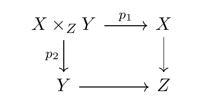

# jsx-tikzcd 

Render `tikzcd` diagrams with JSX.

## Table of Contents

- [Introduction](#introduction)
- [Getting Started](#getting-started)
    - [Installation](#installation)
    - [Set Up](#set-up)
    - [Render](#render)
    - [Components](#components)
    - [Gluing](#gluing)
    - [Duality](#duality)
- [Documentation](#documentation)

## Introduction

`tikzcd` is a powerful LaTeX package that can draw beautiful diagrams used in mathematics, especially category theory. However, its syntax is primarily based on the appearance, not the semantics, which makes it difficult to, say, change the position of a single node without having to redefine the edges.

`jsx-tikzcd` can turn a simple, semantic JSX tree consisting of nodes and edges into `tikzcd` code. The following JSX

~~~js
// JSX code

<Diagram>
    <Node key="prod" position={[0, 0]} value="X\times_Z Y" />
    <Node key="a" position={[1, 0]} value="X" />
    <Node key="b" position={[0, 1]} value="Y" />
    <Node key="base" position={[1, 1]} value="Z" />

    <Edge from="a" to="base" />
    <Edge from="b" to="base" />
    <Edge from="prod" to="a" value="p_1" />
    <Edge from="prod" to="b" value="p_2" alt />
</Diagram>
~~~

yields

~~~latex
% LaTeX code

\begin{tikzcd}
X\times_Z Y \arrow[r, "p_1"] \arrow[d, "p_2"'] & X \arrow[d] \\
Y \arrow[r] & Z
\end{tikzcd}
~~~

which renders into

## Getting Started

### Installation

You can install jsx-tikzcd using npm:

~~~
npm install jsx-tikzcd
~~~

### Set Up

Make sure you have JSX set up correctly in Babel:

~~~js
{
    "plugins": [
        ["transform-react-jsx", {"pragma": "h"}]
    ]
}
~~~

### Render

Then you can render TikZ diagrams like this:

~~~js
import {h, render, Diagram, Node, Edge} from 'jsx-tikzcd'

let tex = render(
    <Diagram>
        <Node key="prod" position={[0, 0]} value="X\times_Z Y" />
        <Node key="a" position={[1, 0]} value="X" />
        <Node key="b" position={[0, 1]} value="Y" />
        <Node key="base" position={[1, 1]} value="Z" />

        <Edge from="a" to="base" />
        <Edge from="b" to="base" />
        <Edge from="prod" to="a" value="p_1" />
        <Edge from="prod" to="b" value="p_2" alt />
    </Diagram>
)
~~~

### Components

You can define your own components and use them to make higher-order components just like in React.

~~~js
import {h, render, Component, Diagram, Node, Edge} from 'jsx-tikzcd'

class Arrow extends Component {
    render() {
        if (this.props.children.length < 2) return

        let [x, y] = this.props.position || [0, 0]
        let [dx, dy] = this.props.direction || [1, 0]
        let [a, b, ] = this.props.children

        return <Diagram>
            <Node {...a.props} position={[x, y]} />
            <Node {...b.props} position={[x + dx, y + dy]} />

            <Edge from={a.key} to={b.key} />
        </Diagram>
    }
}

let tex = render(
    <Diagram>
        <Arrow>
            <Node key="x" value="X" />
            <Node key="y" value="Y" />
        </Arrow>

        <Node key="z" value="Z" position={[2, 0]} />
        <Edge from="y" to="z" />
    </Diagram>
)
~~~

jsx-tikzcd doesn't support state and tracking state changes, so every component is a pure component and can be written as a function as well:

~~~js
const Arrow = function(props) {
    if (props.children.length < 2) return

    let [x, y] = props.position || [0, 0]
    let [dx, dy] = props.direction || [1, 0]
    let [a, b, ] = props.children

    return <Diagram>
        <Node {...a.props} position={[x, y]} />
        <Node {...b.props} position={[x + dx, y + dy]} />

        <Edge from={a.key} to={b.key} />
    </Diagram>
}
~~~

### Gluing

Nodes with the same key will be merged and collapsed into one single node. This is useful to glue multiple sub components together.

~~~js
let tex = render(
    <Diagram>
        <Arrow>
            <Node key="x" value="X" />
            <Node key="y" value="Y" />
        </Arrow>

        {/* Gluing at y */}

        <Arrow position={[1, 0]}>
            <Node key="y" />
            <Node key="z" value="Z" />
        </Arrow>
    </Diagram>
)

// \begin{tikzcd}
// X \arrow[r] & Y \arrow[r] & Z
// \end{tikzcd}
~~~

If there are conflicting attributes, the one that was defined last is used, i.e. attributes that come after will overwrite attributes that came before. Keep in mind that edges are not glued; you can define multiple edges between two nodes.

### Duality

In category theory, there's this concept of an opposite category, in which every arrow of a diagram is reversed. It's possible to automate this process in jsx-tikzcd by adding the attribute `co` to a Diagram:

~~~js
let tex = render(
    <Diagram co>
        <Arrow>
            <Node key="x" value="X" />
            <Node key="y" value="Y" />
        </Arrow>

        <Arrow position={[1, 0]}>
            <Node key="y" />
            <Node key="z" value="Z" />
        </Arrow>
    </Diagram>
)

// \begin{tikzcd}
// X & Y \arrow[l] & Z \arrow[l]
// \end{tikzcd}
~~~

Alternatively, you can use the `corender` function of jsx-tikzcd:

~~~js
import {h, corender, Diagram, Node, Edge} from 'jsx-tikzcd'

let tex = corender(
    <Diagram>
        <Arrow>
            <Node key="x" value="X" />
            <Node key="y" value="Y" />
        </Arrow>

        <Arrow position={[1, 0]}>
            <Node key="y" />
            <Node key="z" value="Z" />
        </Arrow>
    </Diagram>
)
~~~

## Documentation

### `render` and `corender`

#### Arguments

* `vnode` [`<Diagram/>`](#diagram) - The diagram to render
* `options` `<Object>` *(optional)*
    * `align` `<Boolean>` - Determines whether the generated code will vertically align at `&`. Default: `false`

Returns a string which contains the corresponding LaTeX code to the given diagram.

### `<Diagram/>`

#### Props

* `co` `<Boolean>` *(optional)* - Determines whether to reverse all edges
* `options` `<String>` *(optional)* - `tikzcd` environment options

These attributes only work in the root node, i.e. the node that's passed to `render` or `corender`.

### `<Node/>`

#### Props

* `key` `<String>`
* `position` `<Integer[]>` - Has the form `[x, y]`, negative integers are also allowed
* `value` `<String>` *(optional)* - LaTeX label

### `<Edge/>`

#### Props

* `from` `<String>` - Key of the start node
* `to` `<String>` - Key of the end node
* `value` `<String>` *(optional)* - LaTeX label
* `labelPosition` `<String>` *(optional)* - One of `"left"`, `"right"`, and `"inside"`
* `alt` `<Boolean>` *(optional)* - Determines whether the label is positioned on the other side of the arrow
* `args` `<String[]>` *(optional)* - Additional tikzcd arguments of edge, e.g. `"hook"`, `"two heads"`, etc.

## Related

* [tikzcd-editor](https://github.com/yishn/tikzcd-editor) - A simple visual editor for creating commutative diagrams.
